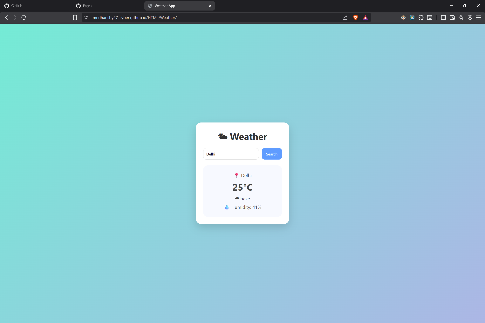

# 🌤 - 🌤️ Weather App → https://medhanshy27-cyber.github.io/HTML/Weather/

A clean and minimal weather website built using HTML, CSS, and JavaScript.

## Features
- City-based weather search
- Clean modern UI
- Responsive design
- Uses OpenWeather API

## Tech Stack
- HTML
- CSS
- JavaScript

## Live Demo
Enable GitHub Pages to see it live 🚀
🌐 Live Demo: https://medhanshy27-cyber.github.io/HTML/Weather/

